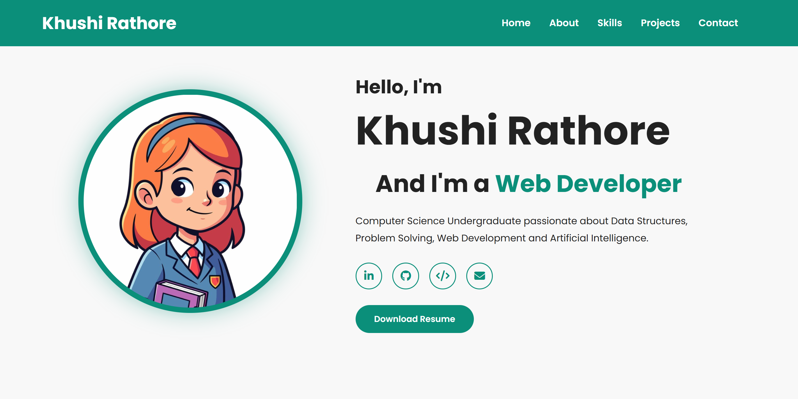
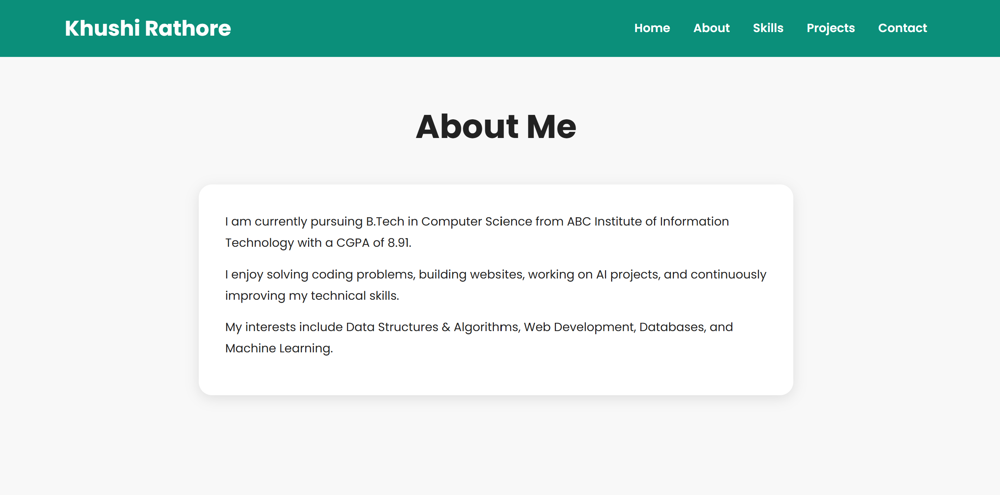
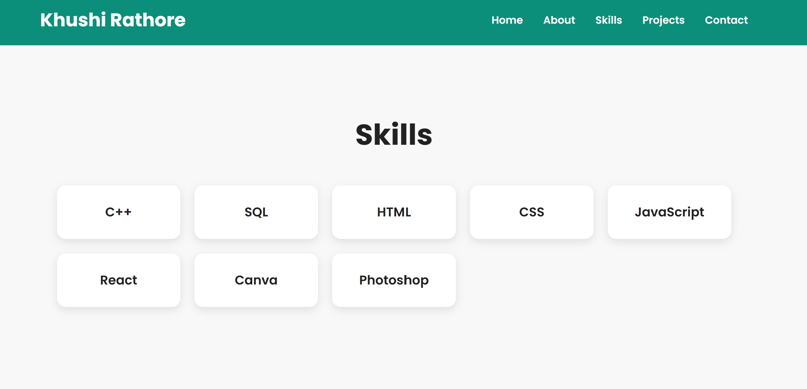
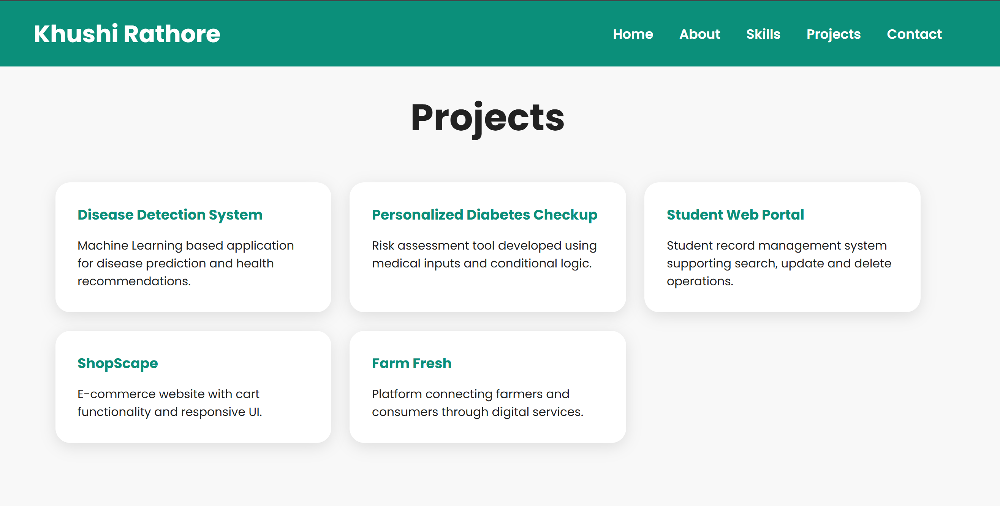
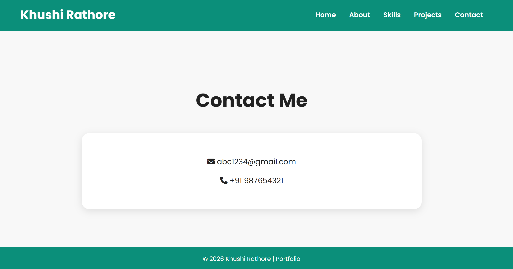

# OIBSIP Task 2 - Personal Portfolio Website

## Overview

This project is a modern and responsive personal portfolio website created to showcase my profile, technical skills, projects, and contact information. It has a clean layout, smooth navigation, and a professional user interface.

## Features

- Responsive Navigation Bar
- Home / Hero Section
- Profile Introduction Section
- About Me Section
- Skills Showcase
- Projects Section
- Contact Information Section
- Social Media Icons
- Download Resume Button
- Responsive Footer
- Mobile-Friendly Design

## Technologies Used

- HTML5
- CSS3
- JavaScript
- Flexbox
- CSS Grid
- Media Queries
- Font Awesome Icons

## Project Structure

```text
Task2/
│
├── index.html
├── style.css
├── script.js
├── p.png
├── ss1.png
├── ss2.png
├── ss3.png
├── ss4.png
├── ss5.png
└── README.md
```

##How to Run
Download or clone the repository.
Open the Task2 project folder.
Run index.html in any modern web browser.
Learning Outcomes


##Through this project, I learned:
Creating a responsive personal portfolio website
Designing layouts using Flexbox and CSS Grid
Structuring a webpage using semantic HTML
Styling modern UI components using CSS
Adding smooth navigation between webpage sections
Creating responsive designs using media queries
Presenting skills, projects, and contact details professionally


##Author
Khushi Rathore

##Internship
Oasis Infobyte Internship Program (OIBSIP)

##Screenshots
### Home Section


### About Section


### Skills Section


### Projects Section


### Contact Section

